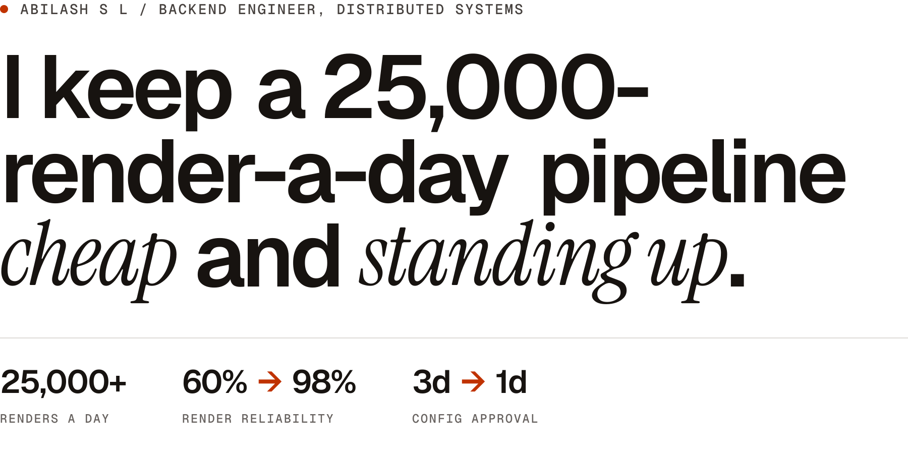

<!-- The header images are drawn by scripts/profile-header.mjs in
     abilash0045/portfolio, from the site's own fonts and colours. Redraw them
     there and copy all four PNGs into assets/. The first source that matches
     wins: the narrow layout on a phone, then the theme. -->

<a href="https://portfolio-madcap1.vercel.app">
  <picture>
    <source media="(max-width: 600px) and (prefers-color-scheme: dark)" srcset="assets/header-narrow-dark.png">
    <source media="(max-width: 600px)" srcset="assets/header-narrow-light.png">
    <source media="(prefers-color-scheme: dark)" srcset="assets/header-dark.png">
    
  </picture>
</a>

At Whilter I work on the video rendering pipeline: Java and Spring Boot over Kafka, Redis and MongoDB, running on GKE and Cloud Run across GCP and AWS. Most of what I do lands on either the cloud bill or the on-call dashboard.

[Portfolio](https://portfolio-madcap1.vercel.app) · [LinkedIn](https://www.linkedin.com/in/abilash0045/) · [LeetCode](https://leetcode.com/u/abilash0045/) · [abilash0045@gmail.com](mailto:abilash0045@gmail.com)

## Selected work

Things I built or fixed, with what broke, what I changed, and what it moved, each written up in full on [the site](https://portfolio-madcap1.vercel.app/#work). Most of it runs inside a company and has no public repo, so the code to read here is the site's own: [abilash0045/portfolio](https://github.com/abilash0045/portfolio).

| Result | Case study |
| :-- | :-- |
| **60% → 98%** render reliability | **[AI Video Generation Platform](https://portfolio-madcap1.vercel.app/#render-reliability)** Scalable event-driven video rendering microservices processing 25,000+ daily renders across GKE and Cloud Run. |
| **85%** customer response workflows automated | **[WhatsApp Automation Platform](https://portfolio-madcap1.vercel.app/#whatsapp-automation)** High-throughput messaging and notification workflows integrating Spring Boot, bot engines, and REST APIs. |
| **~30% + ~10%** cloud spend, cut twice | **[Cutting Cloud Spend, Twice](https://portfolio-madcap1.vercel.app/#cloud-cost)** Two independent cuts to cloud spend: a segment-level Redis cache, then moving render autoscaling off KEDA on GKE onto Cloud Run, scaled on Pub/Sub queue depth. |
| **504 · 200 · 429** three identical Overpass calls, measured | **[Weekend Dartboard](https://portfolio-madcap1.vercel.app/#dartboard)** A map you throw a dart at, built on two public APIs where one of them fails about a third of the time. [Throw one](https://portfolio-madcap1.vercel.app/dartboard). |
| **3 days → 1 day** config approval cycle | **[Visitor Pattern Config Engine](https://portfolio-madcap1.vercel.app/#config-playground)** Extensible domain configuration engine reducing solution engineering approval cycles from 3 days to 1 day. |

## Toolbox

Things I've run in production, not things I've read about.

| Area | Tools |
| :-- | :-- |
| Languages | Java, Python, SQL, TypeScript |
| Backend | Spring Boot, Spring Security, REST APIs, Microservices |
| Messaging | Kafka, GCP Pub/Sub, RabbitMQ |
| Databases | MongoDB, PostgreSQL, MySQL, Redis |
| Cloud | AWS, EKS, S3, ECR, GCP Cloud Run |
| DevOps | Docker, Kubernetes, Git, Maven, Linux |

## Get in touch

If your team works on high-throughput backends, caching, or the kind of infrastructure problems that show up on the bill, I'm happy to talk shop: [abilash0045@gmail.com](mailto:abilash0045@gmail.com).
